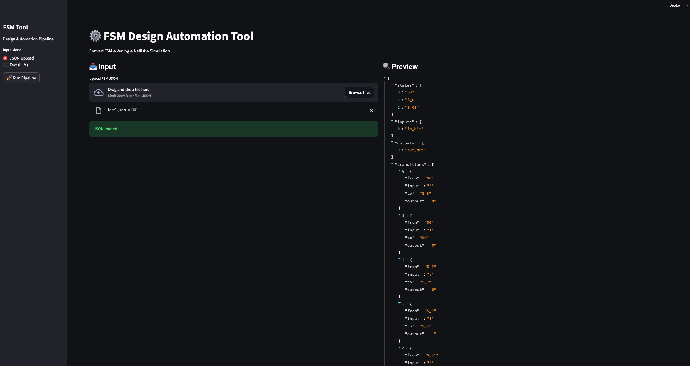
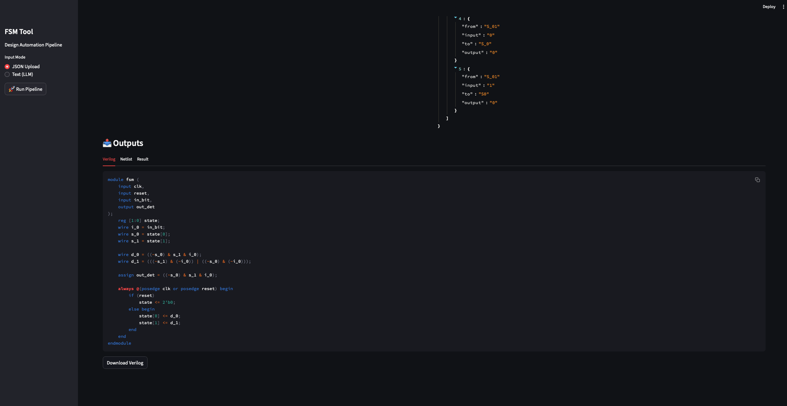
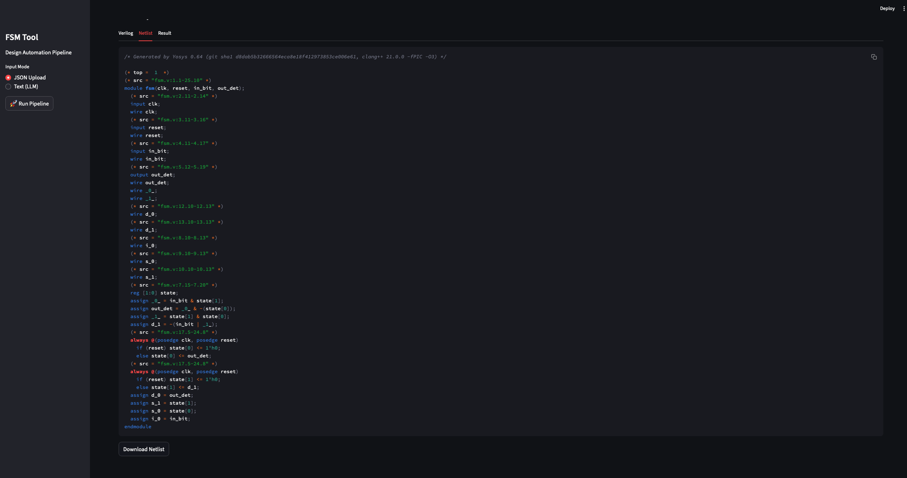

# ⚙️ FSM Design Automation Tool

A complete design automation pipeline that converts a Finite State Machine (FSM) specification into:

- Structural Verilog  
- Gate-level Netlist (via Yosys)  
- Simulation & Verification (Icarus Verilog)  

---

## Features

- JSON-based FSM input  
- Automatic state encoding & logic synthesis  
- Verilog generation  
- Netlist generation using Yosys  
- Simulation + PASS/FAIL verification  
- Interactive UI using Streamlit  

---

## UI Preview

### Input & Preview


### Generated Verilog


### Generated Netlist


---

## Input Format

FSM must be provided in JSON format:

```json
{
  "states": ["S0", "S1"],
  "inputs": ["x"],
  "outputs": ["z"],
  "transitions": [
    {"from": "S0", "input": "0", "to": "S1", "output": "0"},
    {"from": "S1", "input": "1", "to": "S0", "output": "1"}
  ]
}
```

---

## How It Works

Pipeline:

```
FSM JSON
 → Parsing
 → State Encoding
 → Truth Table
 → Boolean Logic Minimization
 → Verilog Generation
 → Netlist (Yosys)
 → Simulation (Icarus Verilog)
 → Verification (PASS / FAIL)
```

---

## Project Structure

```
fsm_tool/
│── app.py
│── main.py
│
│── input/
│── output/
│
│── src/
│   ├── parser.py
│   ├── encoder.py
│   ├── logic.py
│   ├── verilog_gen.py
│   ├── testbench_gen.py
```

---

## Installation

Clone the repo:

```bash
git clone https://github.com/saihari12/fsm_to_verilog.git
cd fsm_to_verilog
```

Install dependencies:

```bash
pip install streamlit pyeda
```

Install required tools:

```bash
brew install yosys icarus-verilog
```

---

## Running the Tool

Run UI:

```bash
streamlit run app.py
```

OR run CLI:

```bash
python main.py input/test1.json
```

---

## Output Files

```
output/
│── fsm.v
│── netlist.v
│── testbench.v
│── result.log
```

---

## Notes

- Uses binary encoding  
- Supports Moore/Mealy-style FSMs  
- Output files are ignored in git  

---

## Author

Sai Hari Krishna